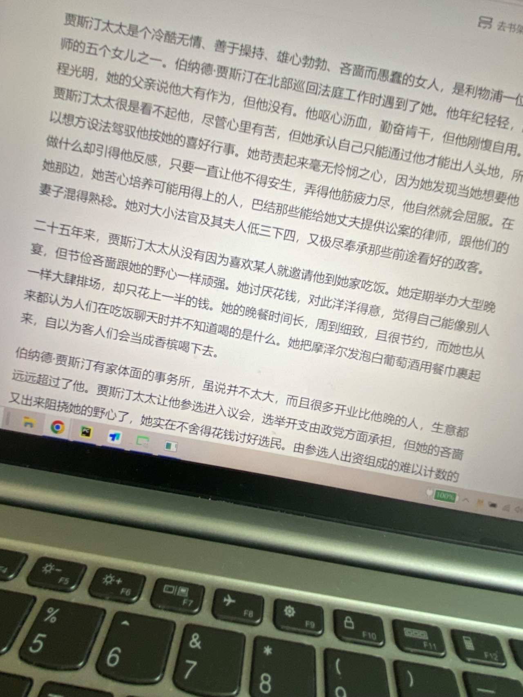
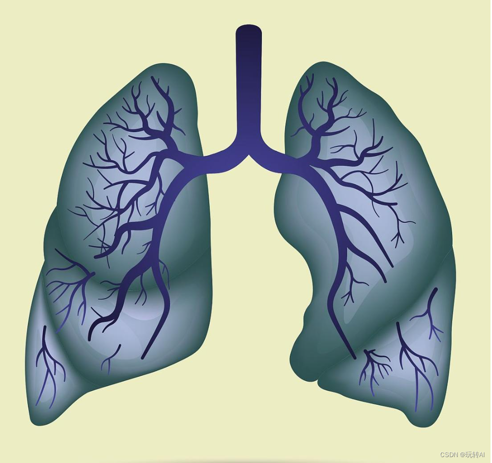
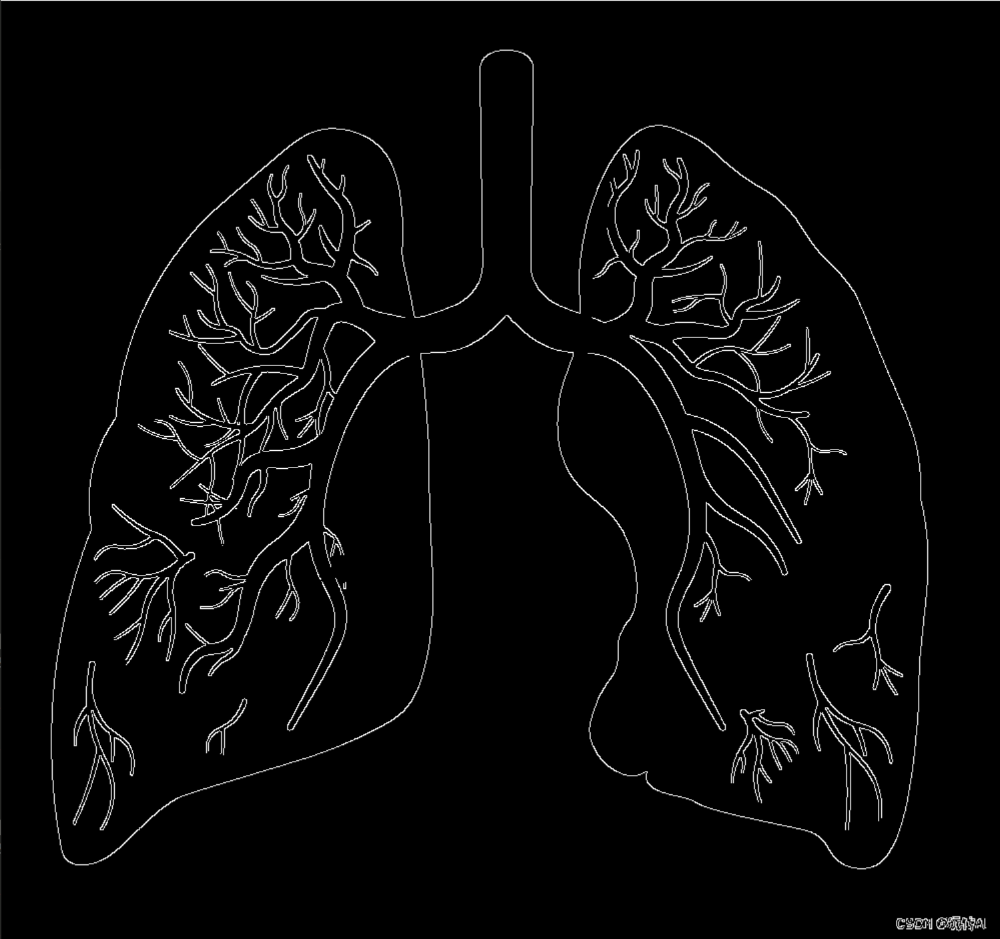

# Image-Angel-correction
基于边缘检测、霍夫变换方法实现图片角度矫正

## 图片矫正步骤
1、将图片转换为灰度图，Canny边缘检测算法提取到图像的边缘 
2、通过霍夫变换检测到图片中的直线，并计算直线与水平方向的角度 
3、计算直线角度的中位数，根据角度对图片进行旋转 
4、最后现实纠正后的图片 

图片矫正的效果图：

矫正前

矫正后

[图片矫正实现代码：angle_corrention.py](./angle_corrention.py)

> 为什么原始图像转化为灰度图：减少计算复杂度、降低数据量、边缘检测更关注变价纹理特征不需要图片中的色彩信息
## Canny边缘检测步骤
1、高斯滤波，对图像做平滑处理滤除一部分噪声； 
2、计算每一个像素点梯度幅值和方向 
3、非极大值抑制，对边缘进行初步筛选，在梯度方向上当前像素点是否为极大值，是极大值则保留，不是极大值的像素点被抑制。 
4、双阈值方法确定边界为强边缘、弱边缘或者非边缘，通过参数设置两个梯度的阈值，如果像素点的梯度超过高阈值，则该点为边界、如果像素点的梯度低于低阈值，则该点不是边界；如果像素点介于高低阈值之间，且该店与已知的边界相连，则该点视为边界。

Canny边缘检测结果❀

## Canny边缘检测中的非极大值抑制如何实现
在边缘检测中非极大值抑制用来去除冗余的边缘 
将图片中所有像素点的梯度近似成为水平、垂直和两个对角线方向的梯度。 

在水平方向和垂直方向的梯度值分为：Gx>Gy/Gx<Gy
水平方向和垂直方向的梯度方向可以分为同号和异号
通过插值的方法计算出和当前像素点梯度方向上的点的梯度值

如果当前像素点的梯度大于计算出的周围像素点的梯度值，则该像素点保留为边界；否则将该像素点抑制。

## 霍夫变换

霍夫变换检测直线的原理： 
在直角坐标系和极坐标系中，直角坐标中的一个点对应极坐标系下的一条正弦曲线； 
在极坐标系中一个点对应直角坐标系下的一条直线 
**在直角坐标系中共线的点对应在极坐标系下的正弦曲线相交于同一点**

通过霍夫变换实现直线检测的步骤： 
1、对于Canny边缘检测得到的像素点，从直角坐标系映射到极坐标系； 
2、根据直角坐标系下共线的点在极坐标系下曲线有公共交点，在极坐标系下，曲线经过的点的像素值+1； 
3、极坐标系下每个像素值代表图像上共线的点的个数； 
4、数值较大的点可以拟合为一条直线，将极坐标系下数值较大的点，反映射会直角坐标系下得到对应的直线。

[霍夫变换实现代码](./hough_trans_test.py)

霍夫变换检测直线可视化结果：

